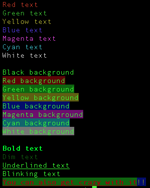

# ColorC
### ⚠️ UPDATE

***The whole ColorC projet has been moved to*** <u>**[gcl](https://github.com/gugu256/gcl)**</u> - ***all possible future modifications will be done there, not in this repo.***

(also, make sure to check out <u>**[gcl](https://github.com/gugu256/gcl)**</u> ;-))

---

ColorC is an easy-to-use, single-header C/C++ library for printing rich text to the terminal



## Installation

To install ColorC, download the library's header `colorc.h` [here](https://github.com/gugu256/ColorC/blob/main/colorc.h) and add it to your C/C++ project

Then, inside of your C/C++ file, add this code snippet:

```c
#include "colorc.h"
```

And you're good to go!

## Usage

The `demo.c` file is a demo file showing you how to use ColorC, check it out to learn ColorC

ColorC supports 8 colors for background and foreground. These colors are :
   
- Black
- Red
- Green
- Yellow
- Blue
- Magenta
- Cyan
- White

It also supports 7 styles (some of them do not work with all terminals though)
The styles are :

- Bold
- Dim
- Italic
- Underline
- Blink
- Framed
- Encircled
